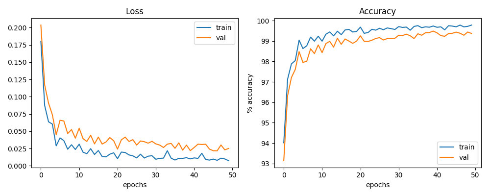

## Context
Hand gesture recognition database is presented, composed by a set of high resolution range images acquired by the latest generation of range / depth cameras: the Microsoft Kinect 2 (second generation). The dataset is available from [Kaggle](https://www.kaggle.com/gti-upm/depthgestrecog) and redistributed under the [Creative Commons Attribution-NonCommercial-ShareAlike 4.0 License)](https://creativecommons.org/licenses/by-nc-sa/4.0/legalcode).

## Results
*GestureNet* is a very simple CNN equipped with ReLU non-linearity, dropout and batch normalization
after each layer with no additional tricks. It works surprisingly well and trains in approx. 10-15 mins.
The loss function used is cross-entropy which is a standard for multi-class classification tasks.
Optimizer used is Adam because it typically leads to faster convergence than SGD.
No schedule for learning rate is used here because the results are pretty good as is.


## Content
The database is composed by 11 different hand-gestures (showed above, where the first row represents dynamic gestures and the second row represents static ones) that are performed by 6 different subjects.

The database is structured in different folders as (a detailed description can be found below):
```
/fist (fist hand-gesture)
/fist/video_base_1 (base fist hand-gesture of subject 1)
/fist/video_base_1/s01_g10_011_1.png,...,s01_g10_050_1.png,...
/fist/video_base_2 (base fist hand-gesture of subject 2)
/fist/video_base_2/s02_g10_011_1.png,...,s02_g10_050_1.png,...
/fist/video_base_6 (base fist hand-gesture of subject 6)
/fist/video_base_6/s06_g10_011_1.png,...,s06_g10_050_1.png,...
/fist/video_moved_1_1 (moved up fist hand-gesture of subject 1)
/fist/video_moved_1_1/s01_g10_011_2.png,...,s01_g10_050_2.png,...
/fist/video_moved_1_2 (moved down fist hand-gesture of subject 1)
/fist/video_moved_1_2/s01_g10_011_3.png,...,s01_g10_050_3.png,...
/fist/video_moved_1_8 (moved up and left fist hand-gesture of subject 1)
/fist/video_moved_1_8/s01_g10_011_9.png,...,s01_g10_050_9.png,...
/fist/video_moved_6_1 (moved up fist hand-gesture of subject 6)
/fist/video_moved_6_8 (moved up and left fist hand-gesture of subject 6)
/grab
/one_finger
/palm (palm hand-gesture)
/thumb_ud
```
Every root folder (fist, grab,...) contains the range images of one hand-gesture. The folder name is the identifier of the hand-gesture (for example fist, palm, thumb_ud,...).

Inside every root folder, there are 54 folders: 6 of them are the base hand-gestures `(/fist/video_base_1,...,/fist/video_base_2)` and the others are the moved hand-gestures used to increment the training samples `(/fist/video_moved_1_1,...,/fist/video_moved_1_8,...,/fist/video_moved_6_1,...,/fist_video_moved_6_8)`. Inside every subfolder, there are a set of range hand images that can be true/positive samples or false/negative samples. The structure of the name of each frame is the same: `sXX_gYY_ZZZ_M.png` where: `- XX` is the subject identifier. `- YY` is the gesture identifier. `- ZZZ` is the number of the frame. `- M` indicates if the frame belongs to the base video `(M = 1)` or if it belongs to a moved video `(M=2,...9)`.

For example, the frame `'s02_g_05_060_1'` indicates that the frame belongs to the fifth gesture, which is performed by the second subject, it is the frame number 60, and it belongs to the base video.

## Dataset Citation
T. Mantecón, C.R. del Blanco, F. Jaureguizar, N. García, “New generation of human machine interfaces for controlling UAV through depth-based gesture recognition“, SPIE Unmanned Systems Technology XVI, vol. 9084, pp. 9084:1- 9084:0C, June 2014. (doi.org/10.1117/12.2053244)